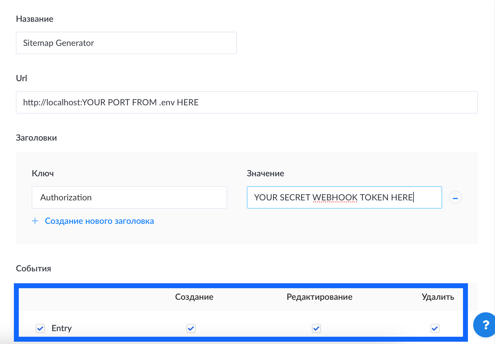

# SiteMap and Robots.txt generator for NextJS with STR API

## Getting started
1. Clone into `scripts` folder into nextjs project 
    ```bash
    cd <your project on nextjs>
    git clone https://github.com/stovv/next-strapi-sitemap.git scripts
    ```
2. Install dependencies
    ```bash
    cd  <your project on nextjs>/scripts
    
    # if you use yarn
    yarn install
    
    # if you use npm
    # npm install 
    ```
3. Update start command in package.json
    ```json
    {
        "name": "project name",
        ...
        "start": "next start & cd scripts;node sitemap-generator.js"
    }
    ```
4. Create `.env` file by example in `.env.example`
    ```dotenv
    # port for sitemap generator server 
    PORT=
    
    # host name of site for sitemap generate
    # e.g https://sitename.com
    HOST=
   
    # host name for your strapi instanse
    # e.g https://strapi.sitename.com
    BACKEND_HOST=
    
    # a secret token that will be transmitted to the generator to check the adequacy of the call
    WEBHOOK_TOKEN=
    ```
6. Generate webhook token  
    You can use services like this https://www.random.org/strings/
7. Go to your strapi admin panel
    1. Open admin/settings/webhooks
    2. Click to `Create New Webhook` button
    3. Fill
        - Name
        - URL = http://localhost:<port from .env file>
    4. Add Header
        - Key = Authorization
        - Value = your generated webhook token from 6 step
    5. Select all action on entry (create, update, delete)
    
    
8. Update `next.config.js` for initial generate sitemaps and robots on `next build`
   ```javascript
    // next.config.js
    const withPlugins = require('next-compose-plugins');
    module.exports = withPlugins(
        [ ],
        {
            webpack: (config, { buildId, dev, isServer, defaultLoaders, webpack }) => {
                if (isServer){
                // Generate sitemaps and robots.txt
                    const { generate } = require('./scripts/generate-sitemap');
                    generate(
                    // Public host name for sitemap generation
                    'https://sitename.ru',
                    // subfolder for generated sitemaps (not index sitemap) in public folder
                    'sitemaps',
                    // folder for generated sitemaps and robots.txt
                    './public',
                    // disallow routes in robots.txt
                    ['/api/', '/login']
                    );
                }
                return config;
            }
        }
    );
   ```
9. Start your project by `yarn start` or `npm run start`

---
### Enjoy! 🤘
